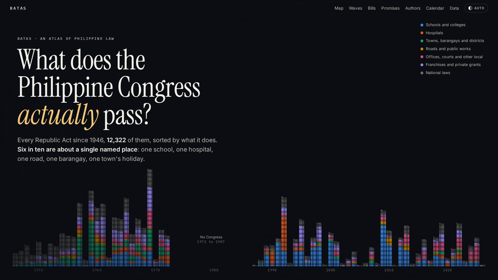

# Batas

## What does the Philippine Congress actually pass?

**Site:** https://daviddemitriafrica.github.io/batas/



Since 1946 the Philippines has enacted 12,322 Republic Acts. We collected every
one, sorted them by what they do using their titles, and found that six in ten
are about a single named place: one school, one hospital, one road, one new
barangay, one town's holiday. Since 1987 the share is seven in ten.

We then put those laws on a map, followed 143,156 House bills from filing to
law, checked the schools and hospitals the laws promise against DepEd's and
PhilHealth's lists, and linked each law to its principal author and to
OpenHalalan's record of who holds office in each province.

A few findings:

- We matched 53 government hospitals whose bed capacity Congress raised by law
  since 2016 to PhilHealth's list. 47 of them are accredited for fewer beds than
  the law says: 19,807 accredited beds against 32,430 promised.
- 85% of the laws from 1987 to 2023 that establish, separate or convert a public
  school name one DepEd lists in that town. Of those passed since 2019, 68% were
  already in DepEd's list before the law.
- In the 8th Congress (1987 to 1992), members filed 35,168 bills, 87% of them
  for one local project. That Congress passed 786 local laws, so at most 3 in 100
  of those bills became law.
- Seats held by political families did not produce more local laws than other
  seats (1.21 against 1.30 per term, with overlapping intervals).
- On June 21, 1969, 506 laws were approved in a single day. Fidel Ramos let 626
  laws, 59% of those in his term, take effect without his signature.

## The site

`docs/` is a static site for GitHub Pages. The opening story draws every law as
one particle in WebGL (`docs/js/story.js`) and moves the same particles between a
timeline, blocks by kind, a map, columns by Congress and towers by signing day
as you scroll. `docs/js/explore.js` is the town map and search, and
`docs/js/charts.js` the charts below it. The numbers the page quotes are read
from `docs/data/*.json`, which `pipeline/make_site_data.py` writes, so they
update when the data is rebuilt.

To preview it locally:

```bash
cd docs && python3 -m http.server 8000   # then open http://localhost:8000
```

## Data

`data/clean/laws.csv` is the main file, one row per Republic Act. See
[`data/CODEBOOK.md`](data/CODEBOOK.md) for every column.

| File | What it is |
|---|---|
| `laws.csv` | Every Republic Act with its kind, scope, places, links, and where each value came from |
| `school_laws.csv` | School laws matched to DepEd's school lists |
| `hospital_laws.csv` | Hospital laws matched to PhilHealth's accredited hospitals |
| `barangay_laws.csv` | Barangay-creation laws matched to the 2020 census |
| `law_bills.csv` | Acts linked to the House bill they came from |
| `law_authors.csv` | Acts with their principal author |
| `rep_terms.csv` | District representatives per Congress, with a family-seat flag |
| `house_bills_classified.csv.gz` | Every House bill since 1987, classified |

## Rebuild

```bash
pip install -r requirements.txt
python3 pipeline/run_all.py            # fetch (cached) and rebuild everything
python3 pipeline/run_all.py --no-fetch # rebuild from the files in the repo
```

DepEd's and PhilHealth's files are committed in `data/raw/`, because their
sites block requests from cloud servers. The act texts, BetterGov's bill
records and OpenHalalan are refetched when missing; facts read from the act
texts are cached in `data/interim/act_facts.json`, so `--no-fetch` works
without them. Every download is logged in `data/provenance.jsonl`.

## Sources

- [LawPhil Project](https://lawphil.net) (Arellano Law Foundation), with 309
  acts missing from LawPhil taken from the [Chan Robles Virtual Law Library](https://laws.chanrobles.com)
  and 22 that neither library has taken from the House record.
- [BetterGov open-congress-data](https://github.com/bettergovph/open-congress-data) (CC0).
- [OpenHalalan](https://robertrleung.github.io/OpenHalalan/): Leung, R., Alejandro, A.,
  Acuna, R., Buot, J., Go, C., and Nable, J. (2026). *OpenHalalan: The Philippine
  National and Local Election Dataset.* [doi:10.5281/zenodo.17783099](https://doi.org/10.5281/zenodo.17783099) (ODbL).
- [DepEd machine-ready files](https://www.deped.gov.ph/machine-ready-files/), enrolment SY 2017-18 to 2025-26.
- [PhilHealth accredited hospitals](https://www.philhealth.gov.ph/partners/providers/facilities/accredited/), July 31, 2026.
- [Philippine Internal Migration Dataset](https://github.com/DavidDemitriAfrica/philippines-internal-migration)
  for the PSGC, former town names and census populations.
- [faeldon/philippines-json-maps](https://github.com/faeldon/philippines-json-maps) for PSA 2023 boundaries.

## Related work

- Acuna, R., Alejandro, A., and Leung, R. (2025),
  [The Families that Stay Together: A Network Analysis of Dynastic Power in Philippine Politics](https://arxiv.org/abs/2505.21280)
- Mendoza, R. U., Beja, E. L., Venida, V. S., and Yap, D. B. (2016),
  [Political dynasties and poverty: measurement and evidence of linkages in the Philippines](https://doi.org/10.1080/13600818.2016.1169264)
- Coronel, S. S., Chua, Y. T., Rimban, L., and Cruz, B. B. (2004), *The Rulemakers: How the Wealthy and Well-Born Dominate Congress*, PCIJ

## Citing this

```bibtex
@misc{africa2026batas,
  author = {Africa, David Demitri},
  title  = {Batas: what does the Philippine Congress actually pass?},
  year   = {2026},
  url    = {https://github.com/DavidDemitriAfrica/batas}
}
```

Code MIT, data ODbL. See [LICENSE](LICENSE).
